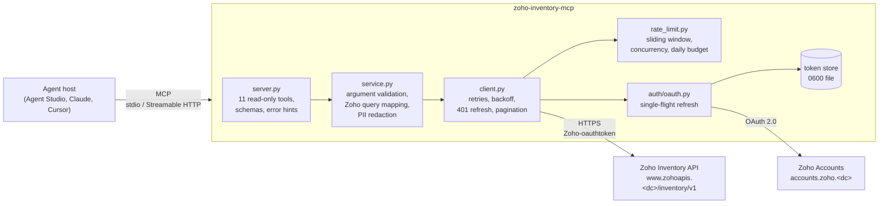

# Architecture & design decisions

Each layer has one job and can be tested without the layers above it:

| Layer | Responsibility | Knows about |
|---|---|---|
| `server.py` | MCP tool surface: names, descriptions, input/output schemas, annotations, error → `isError` mapping | MCP, service |
| `service.py` | Agent-friendly operations (search, get by SKU or order number, low-stock report) mapped to Zoho query params; trims payloads into typed models | Zoho's query vocabulary |
| `client.py` | One `get()` that is safe to call: auth header, `organization_id`, throttling, retries, error classification | HTTP, OAuth, limiter |
| `rate_limit.py` | Process-wide request scheduling | Time |
| `auth/` | Token acquisition, refresh, revocation and storage | Zoho Accounts |

`factory.build_service()` wires everything together, so tests can inject an in-process HTTP transport (the mock server), a memory token store and a fake clock.

## Key decisions

### Read-only by construction
The connector requests `*.READ` scopes and exposes no write tools. That makes it safe to put in front of an LLM on day one: a prompt-injected agent cannot cancel an order. Writes are the obvious next step, but they need human-in-the-loop confirmation and idempotency, so they were left out of v1 deliberately rather than added half-done.

### Rate limiting: prevent first, recover second
Zoho enforces roughly 100 requests per minute per organization, a cap on concurrent calls, and a daily quota per plan. The daily quota is **shared with every other integration the merchant runs**. An agent that loops on `list_items` could stop the merchant's storefront sync. So:

1. **Prevent.** A sliding 60-second window caps requests in *any* rolling minute, and a semaphore caps concurrency. The first version used a token bucket, but a test showed a bucket refilling at N/60 per second can send up to 2N requests in some rolling minute and still trip Zoho. The limiter was switched to a sliding window, and a property-style test now checks every window.
2. **Recover.** On 429, the whole limiter enters a cooldown (honouring `Retry-After`), so parallel calls back off together. 5xx and network errors are retried with exponential backoff and full jitter, capped at `ZOHO_BACKOFF_MAX_SECONDS`.
3. **Budget.** `ZOHO_DAILY_REQUEST_BUDGET` caps how much of the quota the agent may use. If Zoho's `X-Rate-Limit-Remaining` header reaches 0, calls stop *before* they are sent.
4. **Design the tools to be cheap.** The server instructions and tool descriptions tell the model to search rather than page through results. `get_item` and `get_sales_order` accept a SKU or order number directly, saving a round trip, and page sizes are capped.

### Errors are part of the agent interface
Every failure becomes a typed `ZohoError` with a `hint` that is written for the model:

| Error | Example hint |
|---|---|
| `NotFound` | "use a search tool to find the right ID before retrying" |
| `RateLimited` | "wait about 30s… prefer fewer, more specific calls" |
| `AuthenticationRequired` | "ask the operator to run `auth login`. Do not retry." |
| `DailyBudgetExceeded` | "do not retry today; tell the user" |

The goal is that the agent fails *usefully* instead of looping.

### Small, typed responses
A raw Zoho sales order has 100+ fields. The models in `models.py` keep around 15, plus derived fields such as `is_low_stock`. That saves context, reduces hallucination, and produces an `outputSchema` that hosts can validate against.

### Pagination
List tools return `{results, page, per_page, has_more, next_page}`, a direct mapping of Zoho's `page_context` that models handle reliably. Internal scans (`get_low_stock_items`) are bounded and report `truncated` rather than silently dropping data.

### Testing strategy
`src/mock_zoho` is a Starlette app that behaves like Zoho in the ways that matter: the OAuth code and refresh grants (including HTTP-200 errors and single-use codes), scope checks, `organization_id` validation, pagination, a real sliding-window 429, the quota headers, and failure injection. Tests run the real client against it in-process through `httpx.ASGITransport`, with a fake clock shared by both sides, so a 60-second rate-limit scenario runs in milliseconds and gives the same result every run.

| Suite | What it proves |
|---|---|
| `test_oauth.py` | Consent URL, code exchange, single-use codes, proactive and 401-triggered refresh, single-flight refresh under concurrency, revoke, `0600` token file, localhost login with state validation |
| `test_resilience.py` | 429/5xx retry, bounded backoff, giving up, recovery when the server limit is below the client's, zero 429s when configured correctly, daily budget, Zoho quota header |
| `test_rate_limit.py` | Sliding window never exceeds N in any 60s, concurrency cap, cooldown, budget reset |
| `test_tools.py` | Tools over the real MCP protocol: catalogue and annotations, every tool's happy path, filters, pagination, validation errors, not-found hints, PII redaction |

`scripts/demo.py` (run in CI) launches the server as a **subprocess over stdio**, the way an agent host does.
